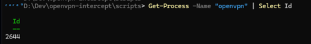
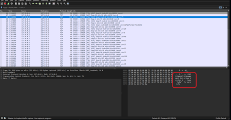
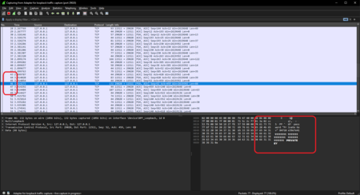
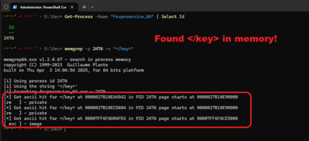

# OpenVPN Interceptor - To use Freedome with any OpenVPN client

<br>

How to use Freedome VPN without the official client on Android, Windows, Linux, FreeBSD, anything basically you can run OpenVPN on.

**Might not work, Ive seen in the logs the openvpn.exe signature is now verified**

## Preparation

### Prerequisites you must download and install:

1. Download Wireshark and install it

### Get your private key / certificate

1. Extract your keys from **C:\ProgramData\F-Secure\FSVpnSDK\keys** and copy them sowhere safe, keep backup if possible.
1. Extract the *x1.crt* file from **C:\ProgramData\F-Secure**

### Get the private key password

1. Run Freedome, log in with your account, connect to the VPN
1. Open a PowerShell Console, get the **PID** of **openvpn.exe** <sup>[1](#ref1)</sup>
1. Then run ```NETSTAT.EXE -aon | findstr <PID HERE>``` to get the local port openvpn is connected to.<sup>[2](#ref2)</sup>
1. Open WireShark and set the filter to the port **openvpn.exe** is using <sup>[3](#ref3)</sup>
1. Reconnect and disconnect from the VPN
1. Analyse the capture, see thet openvpn.exe is used with *-stdin* and management mode <sup>[4](#ref4)</sup>
1. you will see the private key. <sup>[5](#ref5)</sup>


### ~~Using the openvpn.exe stub~~

**In the latest version, FSVpnSDK checks the openvpn.exe digital signature so this wont work anymore**

1. ~~Compile the project~~
1. ~~Run scripts/install.ps1, it will replace the **openvpn.exe** after making a backup~~
1. ~~Run Freedome, log in with your account, connect to the VPN~~
1. ~~Get your dumped config~~

### Creating the configuration file

1. You have to remove STX characters from the captured output
1. Find the second ```</connection>``` tag and delete everything after it
1. Remove empty lines before ```</ca>```
1. Remove all lines that start with management
1. Remove block-outside-dns
1. Replace cert ```[path]``` with where your ```client.crt``` is (check **C:\ProgramData\F-Secure\FSVpnSDK\keys** as administrator)
1. Place your password in a file of your choosing and add the line askpass [your file's name] to have it autologin to the VPN (You might also want to chmod 600 the file


### Summary

In your OpenVPN folder you should have an openvpn configuration file, your client.crt and your password in a file.

Make sure the remote address (freedome-fi-gw.freedome-vpn.net) and the port (2745) is what you want to use, you can also see that in the TCP stream. 
If you don't want to use the Finnish gateway then feel free to sniff out other gateways, I suspect changing the two-letter code is enough...

### openvpn-intercept

1. Compile openvpn-intercept with visual studio
2. Optionally configure log path and out file path using the -p and -l argument, use -d for debug output
3. Use the scripts/install.ps1 to backup current openvpn.exe and replace with compiled version.

### List VPN using scripts

use *[scripts/Get-FSecureSiteList.ps1](scripts/Get-FSecureSiteList.ps1)* <a id="ref6"></a>

### Example configuration

If you have your private key, password, the CA cert already and the gateway you wish then you can replace values here .. code-block:

Important: **comment out ; pull-filter ignore redirect-gateway** That means the server does tell the client to redirect the traffic, but the client is still explicitly configured to ignore this push.

```bash
<ca>
CERTIFICATE HERE
</ca>
<key>
PRIVATE KEY HERE
</key>
cert <cert path here>
verb 4
client
dev tun
suppress-timestamps
preresolve
route-delay 0 12
push-peer-info
setenv UV_CLP peerid:2
replay-window 512 15
tcp-queue-limit 128
nobind
float
resolv-retry 20
server-poll-timeout 10
persist-key
mute-replay-warnings
remote-cert-tls server
data-ciphers AES-256-GCM:AES-128-GCM:AES-256-CBC
; comp-lzo
allow-compression no
cipher AES-256-CBC
auth SHA256
; pull-filter ignore redirect-gateway
<connection>
fragment 1400
remote freedome-ca-montreal.freedome-vpn.net 2747 
proto udp
explicit-exit-notify 1
</connection>
<connection>
remote freedome-ca-montreal.freedome-vpn.net 443 
proto tcp-client
</connection>

```


 -------------------------------

<a id="ref1"></a> [1] 



-------------------------------

<a id="ref2"></a>[2] 


-------------------------------

<a id="ref3"></a>[3] 


-------------------------------

<a id="ref4"></a>[4] 



-------------------------------

<a id="ref5"></a>[5] 



-------------------------------

<a id="ref6"></a>[6] 


-------------------------------


## 💡 Advanced - Get Private Key #1

Because your private key is NOT ONLY encrypted using DES, but DOUBLY ENCRYPTED on disk using a proprietary algorithm so you cannot using it as-is with openvpn.exe. 
We need to get the clear version of the encrypted-base64 key we can use. The latter will then be decrypted using the password we got in wireshark <sup>[5](#ref5)</sup>

Having not idea how to decrypt it, I was trying to generate errors to get meaningful logs.

1. Disconect VPN, and break and invalidate my key <sup>[7](#ref7)</sup>
2. Monitor log files, check for ERROR, Warning, etc... <sup>[8](#ref8)</sup>
3. Reconnect VPN, waitin... BOUM! Good hint! **The code looks for a string** ```"</key>"``` in the **decrypted text**
4. Set the good key back using the backup we did earlier <sup>[9](#ref9)</sup>


## 💡 Advanced - Get Private Key #2

To do this, you need **my memory search tool** [console.memgrep](https://github.com/arsscriptum/Console.MemGrep)

1. Search for a string in a specific process <sup>[10](#ref10)</sup>
1. Search for a string in a specific process, print data around found instance <sup>[11](#ref11)</sup>
1. Search for a string in a specific process, print data around found instance <sup>[12](#ref12)</sup>
1. Get the size of data between 2 points <sup>[13](#ref13)</sup>
1. Dump only printable text around matches and write to file <sup>[14](#ref14)</sup>
1. Fix key format <sup>[15](#ref15)</sup>

-------------------------------

<a id="ref7"></a>[7] 


-------------------------------

<a id="ref8"></a>[8] 


-------------------------------

<a id="ref9"></a>[9] 


-------------------------------

<a id="ref10"></a>[10] 



-------------------------------

<a id="ref11"></a>[11] 


-------------------------------

<a id="ref12"></a>[12] 


-------------------------------

<a id="ref13"></a>[13] 


-------------------------------

<a id="ref14"></a>[14] 


-------------------------------

<a id="ref15"></a>[15] 


-------------------------------
